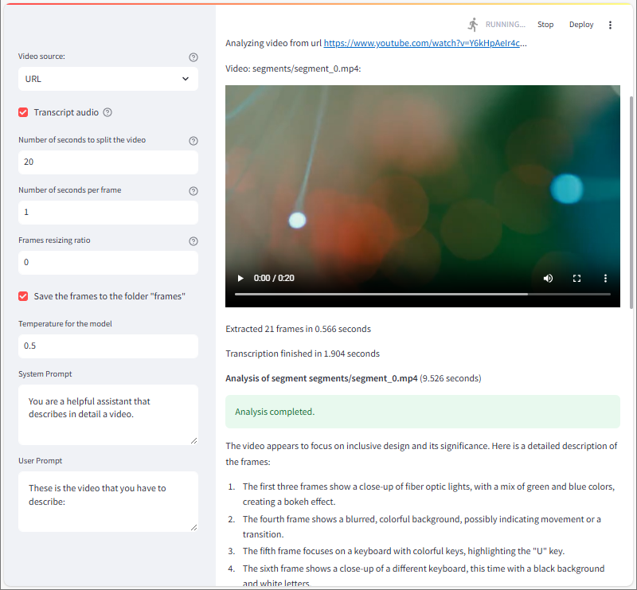

# Video Analysis with GPT-4o

The aim of this respo is to demonstrate the capabilities of GPT-4o to analyze and extract insights from a video file or a video url (e.g. youtube)

The steps to process a video are the following:
1. Split the video in segments of N seconds (or not, if 0 seconds is specified)
2. Extract the frames of the video, 1 frame per second
3. Transcribe the audio with Whisper, if so selected
4. Analyze the frames and the audio (optional) to extract the description, the summarization, or any other insights depending of the prompt

## Prerequisites
+ An Azure subscription, with [access to Azure OpenAI](https://aka.ms/oai/access).
+ An Azure OpenAI service with the service name and an API key.
+ A deployment of GPT-4o model on the Azure OpenAI Service.
+ A deployment of whisper model on the Azure OpenAI Service.

I used Python 3.12.5, [Visual Studio Code with the Python extension](https://code.visualstudio.com/docs/python/python-tutorial), and the [Jupyter extension](https://marketplace.visualstudio.com/items?itemName=ms-toolsai.jupyter) to test this example.

### Set up a Python virtual environment in Visual Studio Code

1. Open the Command Palette (Ctrl+Shift+P).
1. Search for **Python: Create Environment**.
1. Select **Venv**.
1. Select a Python interpreter. Choose 3.10 or later.

It can take a minute to set up. If you run into problems, see [Python environments in VS Code](https://code.visualstudio.com/docs/python/environments).

The needed libraries are specified in [requirement.txt](requirements.txt).

Here is the code of this demo: [video-analysis-with-gpt-4o.py](video-analysis-with-gpt-4o.py)

A screenshot:

To run the application execute this command: streamlit run video-analysis-with-gpt-4o.py

To deploy the application on your Azure tenant in an Azure Container Registry (Docker), follow this [guide: Build and store an image by using Azure Container Registry](https://learn.microsoft.com/en-us/training/modules/deploy-run-container-app-service/3-exercise-build-images) and then create and deploy the web app following this [guide: Create and deploy a web app from a Docker image](https://learn.microsoft.com/en-us/training/modules/deploy-run-container-app-service/5-exercise-deploy-web-app).
